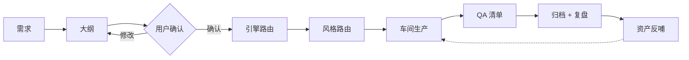

# 多引擎 PPT 生成系统

### 从单一模板到 PPT 工厂 —— PPT Factory 演进蓝图

<div class="pt-12 text-sm opacity-70">
  内部规划汇报 · 2026 年 9 月
</div>

---

# 为什么需要演进

现有 HTML 模板系统已经跑通了「模板 + 智能体」的核心链路。

<v-click>

但用 AI 做 PPT 的方式天然多样：

</v-click>

<v-click>

- **Slidev**：技术演讲、代码演示、强交互

</v-click>

<v-click>

- **HTML 单文件**：冻结快照、离线交付、微信直发

</v-click>

<v-click>

- **AI 生图 → PPT**：视觉驱动、海报风格（未来）

</v-click>

<v-click>

一种生成方式覆盖不了所有场景 —— 需要一个**多引擎基地**。

</v-click>

---

# 愿景：两层架构

<div class="grid grid-cols-2 gap-8 pt-4">

<div>

## 第一层 · 引擎层

<v-clicks>

- 适配多种 PPT 制作方式
- Slidev / HTML / AI 生图 …
- 每个引擎是一个「车间」
- 统一接入契约，可插拔

</v-clicks>

</div>

<div>

## 第二层 · 案例层

<v-clicks>

- 每种模式下人工介入打磨
- 案例是核心资产，不是副产品
- 复盘驱动：教训与风格反哺引擎
- 越用越强的飞轮

</v-clicks>

</div>

</div>

---

# 引擎选型

| 需求场景 | 引擎 | 产物形态 |
| --- | --- | --- |
| 冻结快照 / 离线交付 / 微信直发 | HTML 单文件 | 一个 `index.html` |
| 技术演讲 / 代码演示 / 演讲者模式 | Slidev | 应用型网页 + PDF / PPTX |
| 海报风 / 视觉驱动（规划中） | AI 生图 → PPT | 图像 + HTML 骨架 |

<div class="pt-6">

<v-click>

选型原则：**按交付场景选引擎，而不是按熟悉程度选工具。**

</v-click>

</div>

---
layout: two-cols
---

# 引擎 ①：HTML 单文件

<v-clicks>

- 模板 + 模式库装配铁律
- 主题变量定制视觉
- 零依赖：双击即放、断网可用
- 固定 16:9 等比缩放

</v-clicks>

<v-click>

**最适合**：正式交付、归档、
对兼容性零容忍的场合

</v-click>

::right::

<div class="ml-6 pt-2">

```text
templates/base/     # 骨架 + 主题
patterns/           # 12 种布局模式
docs/WORKFLOW.md    # 装配铁律
```

<div class="pt-6 text-sm opacity-70">

产物：冻结快照<br>
修改：直接手术，禁止回源重组装

</div>

</div>

---

# 引擎 ②：Slidev

Markdown 写作 → 网页 PPT，开发者演讲的主流方案。

<v-clicks>

- 代码高亮分步演示（`{2|3-4|all}`）
- 演讲者模式 + 手机遥控
- Mermaid 图表、LaTeX 公式
- 导出 PDF / PPTX / 静态网页

</v-clicks>

<v-click>

<div class="pt-2">

本仓库已内置 **5 套中文模板**（`engines/slidev/templates/`）：

`cn-default` · `cn-seriph` · `cn-geist` · `cn-takahashi` · `cn-dracula`

</div>

</v-click>

---

# 引擎 ③（规划）：AI 生图 → PPT

<v-clicks>

- 图像模型生成视觉素材 + HTML 骨架组装
- 适合海报风、强视觉、少量文字的 deck
- 接入需满足统一契约：能力边界 README + 生产规则 + QA 清单

</v-clicks>

<v-click>

**原则：先让两条产线跑顺，再开第三条。**

</v-click>

---

# 风格 × 引擎：正交矩阵

风格是跨引擎资产，不寄生在任何单一引擎里。

| | HTML | Slidev | AI 生图 |
| --- | --- | --- | --- |
| linear-dark | ✓ | ✓ | — |
| stripe-mesh | ✓ | 待实现 | — |
| anthropic-paper | 待实现 | ✓ | — |

<div class="pt-4">

<v-click>

演进原则：**同一风格第二次跨引擎出现时，才抽取为独立风格库**（`styles/`）。

</v-click>

</div>

---

# 生产流水线



<v-click>

前两步与最后三步全厂统一（工艺层），中间三步各引擎自治 —— 这就是「两层」在流程上的落点。

</v-click>

---

# 案例沉淀机制

每个交付的 deck 都归档为 `cases/<日期-slug>/`：成品 + 复盘文档。

<v-clicks>

- **需求与约束**：原始要求、受众、时长
- **关键决策**：为什么选这个引擎与风格
- **大纲演变**：初稿到终稿改了什么
- **QA 记录**：检查清单与修复过程
- **可反哺资产**：值得回填引擎的模式、主题、素材

</v-clicks>

<v-click>

**没有复盘的交付不算完成** —— 案例是工厂的核心资产。

</v-click>

---

# 演进路线

| 阶段 | 目标 | 验收标志 |
| --- | --- | --- |
| 0 · 骨架 | 目录 + 路由协议 + 空案例库 | AI 能正确路由一次需求 |
| 1 · 试产 | 每条产线跑 1-2 个真实案例 | 每引擎至少 1 个归档案例 |
| 2 · 沉淀 | 从案例抽取风格与模式 | 首批跨引擎风格入库 |
| 3 · 扩产 | 接入第三引擎（AI 生图） | 新车间两小时出首个案例 |

---
layout: center
class: "text-center"
---

# 谢谢

### 本 deck 即 Slidev 引擎的首个完整案例

<div class="pt-6 text-sm opacity-60">
  引擎入口：engines/slidev · 流程：AGENTS.md 路由
</div>
