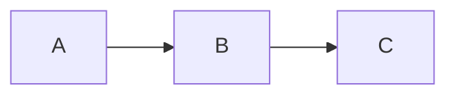

# slides.md 语法速查

## 项目结构

```
my-deck/
├── slides.md        # 主文件（必需）
├── style.css        # 全局样式（自动加载）
├── components/      # 自定义 Vue 组件（自动注册）
├── pages/           # 可选拆分页（src 引用）
├── public/          # 静态资源（/xxx.png 引用）
└── snippets/        # 代码片段（<<< @/snippets/x.ts 引用）
```

## 全局 frontmatter（文件头部）

```yaml
---
theme: default        # 主题名（npm 包名去 slidev-theme- 前缀）
title: 演讲标题
highlighter: shiki
transition: slide-left   # slide-left | fade | view-transition
mdc: true                # [语法]{class} 行内属性
lineNumbers: false
lang: zh-CN
drawings:
  persist: false         # 画笔标注是否跨刷新保留
exportFilename: my-talk  # 导出文件名
---
```

## 单页 frontmatter

```yaml
---
layout: two-cols        # 布局
class: 'text-center'    # 附加 class
background: /bg.png     # 背景图
---
```

常用布局：`cover` `center` `table-of-contents` `two-cols` `image-right` `image-left` `quote` `end` `fact` `statement` `section` `iframe`（主题可自带更多）。

## 分页与引用

```markdown
第一页内容

---

第二页内容
```

```yaml
---
src: ./pages/other.md   # 把外部文件拼进主文件
---
```

## 代码块

````markdown
```ts {2|3-4|all}      # 行高亮，| 分步点击
code here
```

```ts {maxHeight:'100px'}   # 长代码滚动
```

```ts twoslash        # TypeScript 类型信息（hover/内联）
```
````

## 动画 / 分步

```markdown
<v-click>点击后出现</v-click>

<v-clicks>      <!-- 列表逐条出现 -->

- 要点一
- 要点二

</v-clicks>

<v-click at="3">      <!-- 指定第几步出现 -->
```

元素级动画：给任意元素加 `v-after`、`v-click-hide`；页面切换动画在 frontmatter `transition:`。

## 图表 / 公式 / 图标

````markdown


$\alpha + \beta$          行内公式
$$ ... $$                 块级公式

<mdi-account-circle />     图标：集合格式 <集合名-图标名 />
````

## 排版（UnoCSS 原子类）

```html
<div class="grid grid-cols-2 gap-4">
<div class="text-2xl font-bold text-blue-400">
<div class="absolute bottom-10 right-10 opacity-60">
```

MDC 语法（mdc: true 时）：`**加粗**{.text-red-500}`

## 演讲备注

```markdown
---

# 页面

<!-- 这段注释会成为演讲者模式的备注 -->

```

## CLI 命令

| 命令 | 作用 |
| --- | --- |
| `slidev <slides.md>` | 开发预览 |
| `slidev build <slides.md>` | 构建静态网页 → dist/ |
| `slidev export <slides.md>` | 导出 PDF（--format png/md/pptx） |
| `slidev export-notes` | 只导演讲备注 |
| `slidev format` | 格式化 slides.md |

## 快捷键（演示中）

| 键 | 功能 |
| --- | --- |
| `←→` / 空格 | 翻页 |
| `d` | 暗 / 亮切换 |
| `o` | 总览网格 |
| `f` | 全屏 |
| `c` | 计时器 |
| 画笔模式 | 右下角工具栏 |
