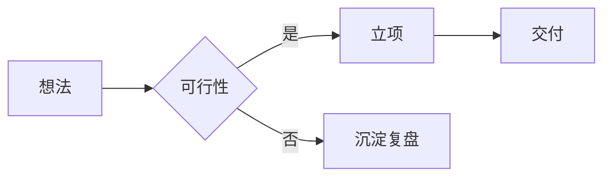

# 通用演示模板

### 副标题：适用于技术分享 / 产品介绍 / 团队汇报

<div class="pt-12">
  <span class="px-2 py-1 rounded cursor-pointer" hover="bg-white bg-opacity-10">
    演讲人姓名 · 2026 年 9 月
  </span>
</div>

---
layout: table-of-contents
---

# 目录

---
src: ./pages/agenda.md
---

<!-- 上方为演示「按文件拆分页面」的写法：把 pages/*.md 拼进主文件，删除这页即可 -->

---
layout: two-cols
---

# 左右双栏

左侧放观点文字，右侧放图或代码。

<v-click>

按一下翻页键，这段文字才出现 —— 用于控制讲述节奏。

</v-click>

::right::

<div class="ml-4">

# 右侧栏

可以放截图、架构图、二维码等。

用 UnoCSS 原子类直接排版：<span class="text-blue-400">文字上色</span>

</div>

---

# 代码演示

Slidev 的看家本领：行高亮可以分步出现。

```ts {2|3-4|all}
interface User {
  id: number
  name: string
  email: string
}

export function greet(user: User) {
  return `你好, ${user.name}!`
}
```

---

# 图表：Mermaid

用文本描述直接生成流程图，不用截图。



---
layout: quote
---

# 引用页

> 好的演示文稿不是把所有信息塞进页面，
> 而是引导听众跟着你的节奏思考。

<div class="text-sm opacity-60 pt-2">—— 演讲经验</div>

---
layout: center
class: text-center
---

# 谢谢观看

### Q & A

<div class="pt-4 text-sm opacity-60">
  联系方式 · 二维码 · 链接
</div>
