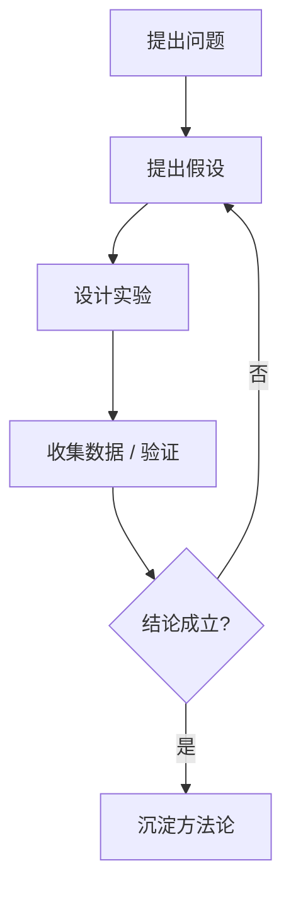

# 正式汇报模板

### 衬线字体 · 学术与商务场合

  汇报人 · 部门 · 2026 年 9 月

---

# 汇报结构

| 章节 | 内容 | 时长 |
| --- | --- | --- |
| 一 | 背景与问题 | 5 min |
| 二 | 方案与路径 | 10 min |
| 三 | 结果与数据 | 5 min |
| 四 | 结论与展望 | 5 min |

---

# 背景：为什么做这件事

<v-click>

- 现状：现有流程耗时且不可复用

</v-click>

<v-click>

- 痛点：数据孤岛，人工统计易出错

</v-click>

<v-click>

- 目标：把周期从 **两周** 压缩到 **一天**

</v-click>

---

# 方法：技术路线

---

# 数据：公式排版

逻辑回归的交叉熵损失：

$$
\mathcal{L}(\theta) = -\frac{1}{N}\sum_{i=1}^{N}\left[y_i\log\hat{y}_i + (1-y_i)\log(1-\hat{y}_i)\right]
$$

---
layout: quote
---

# 核心结论

> 引入自动化流水线后，交付周期缩短 **92%**，
> 人工介入环节从 7 个降至 1 个。

---
layout: center
class: "text-center"
---

# 谢谢

### 欢迎提问与讨论

  附录与数据明细见配套文档

